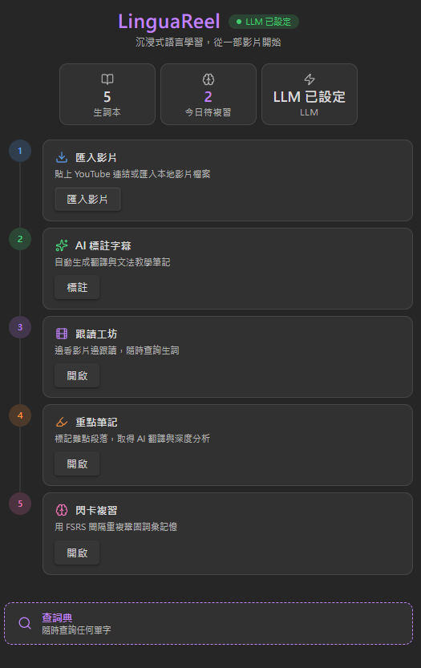
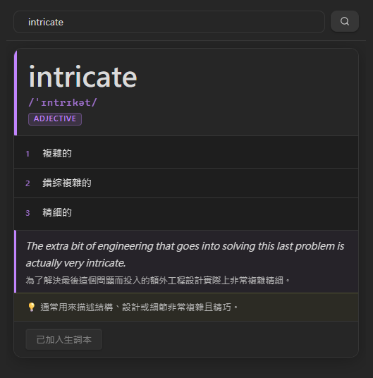
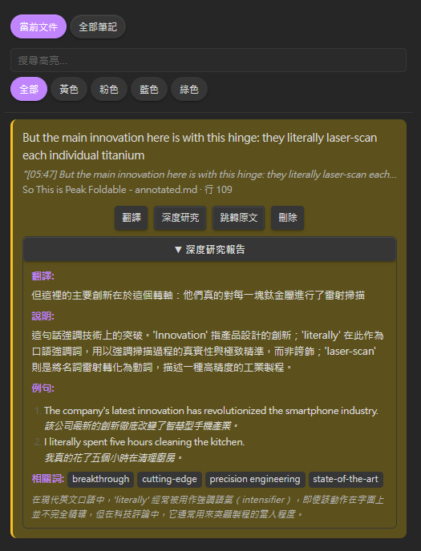
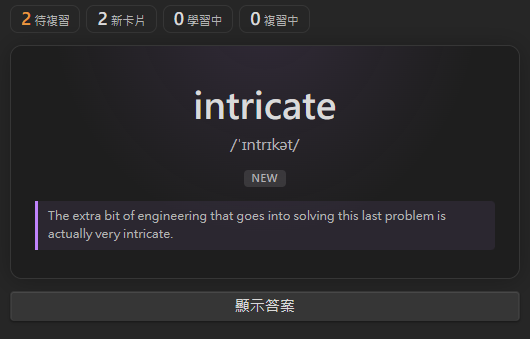
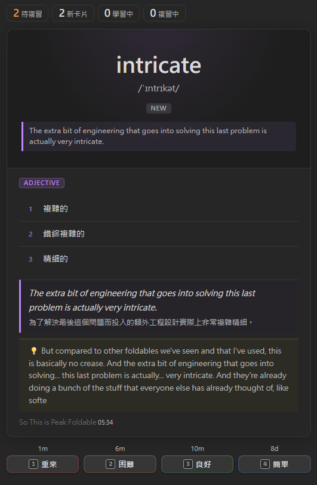

<div align="center">

# LinguaReel

*一款以 AI 為核心的 Obsidian 語言學習插件*

[](https://obsidian.md)
[](https://www.typescriptlang.org)
[](LICENSE)

**Language / 語言：** [English](README.en.md) · [繁體中文](README.md) · [简体中文](README.zh-CN.md)

*靈感來自 [obsidian-English-Made-Easy](https://github.com/PandoraReads/obsidian-English-Made-Easy)*

<!-- TODO: 插入整體 UI 截圖或 Demo GIF（建議：並排顯示五個面板） -->

</div>

---

LinguaReel 的大多數功能**直接依賴 LLM**，沒有 LLM 就沒有查詞、沒有標注、沒有高亮翻譯。這是刻意的設計選擇：

| 功能 | 說明 |
|------|------|
| **查詞** | LLM 依照上下文即時生成讀音、詞性、定義、例句和文法說明，而非固定詞典 |
| **字幕標注** | LLM 逐行閱讀字幕，自行判斷哪些詞彙值得學習，並寫出對應的文法課程 |
| **高亮研究** | LLM 對你標記的文字進行深度解析，不只是翻譯，而是提供語境詮釋 |
| **語言包** | 用自然語言直接「指導」LLM 的標注風格，不需要修改任何程式碼 |

> [!NOTE]
> 影片匯入功能依賴 **yt-dlp** 和 **Whisper / WhisperX**，均為選用工具，未安裝不影響其他 AI 功能。

---

## 目錄

- [學習流程](#學習流程)
- [五大面板](#五大面板)
- [外部工具依賴](#外部工具依賴)
- [安裝插件](#安裝插件)
- [LLM 設定](#llm-設定)
- [其他設定](#其他設定)
- [資料儲存](#資料儲存)
- [語言包](#語言包)
- [鍵盤快捷鍵](#鍵盤快捷鍵)
- [開發](#開發)
- [致謝](#致謝)

---

## 學習流程

LinguaReel 的五個面板共同構成一套完整的沉浸式學習循環：

```
匯入影片（ShadowingView）
    ↓
AI 標注字幕（HomeView → AnnotationPipeline）
    ↓
邊看影片邊查生詞（ShadowingView + DictView）
    ↓
標記難點，AI 翻譯與研究（HighlightView）
    ↓
FSRS 閃卡複習生詞（FlashcardView）
```

---

## 五大面板

### Home — 儀表板

<div align="center">
  
</div>

Home 是整個插件的控制中心，顯示 LLM 連線狀態、生詞總數、今日待複習數量，以及進入各模組的快速入口。

最重要的功能是**標注作業管理**：當你對一部影片字幕啟動 AI 標注後，作業會在背景批次執行，Home 面板即時顯示每項作業的進度條與 LLM 串流輸出預覽。

---

### DictView — AI 查詞

<div align="center">
  
</div>

查詞是 LinguaReel 的核心入口。不同於傳統詞典，LinguaReel 的查詞結果由 LLM **依照當下語境**即時生成，每次查詢都能得到與使用情境相符的解釋。

**使用方式**

| 方式 | 說明 |
|------|------|
| 面板搜尋 | 在面板搜尋框直接輸入單字 |
| 快速查詞 | 在 vault 任何筆記中 **Ctrl + 雙擊** 文字，自動帶入上下文觸發查詞 |

**LLM 生成的內容包括：** 讀音（Reading）、詞性（POS）、定義（可能多條）、例句及其翻譯、文法或慣用說明（Notes）。

查詞完成後，一鍵「加入生詞本」即可在 `Vocabulary/` 資料夾建立對應的 `.md` 筆記，供閃卡複習使用。

---

### HighlightView — 高亮筆記

<div align="center">
  
</div>

在閱讀或觀看字幕時，對任何感興趣的文字使用 Obsidian 標準的 `==高亮語法==` 標記，HighlightView 就會自動掃描並集中管理這些標記。

**AI 功能（均由 LLM 執行）**

| 功能 | 使用模型 | 說明 |
|------|---------|------|
| 翻譯 | 快速模型 | 快速取得該段文字的中文翻譯 |
| 深度研究 | 強力模型 | 分析詞彙、語境、慣用法，適合深入理解難點 |

> [!TIP]
> 翻譯與研究結果會持久化儲存，重開 Obsidian 後不需重新生成。

---

### FlashcardView — FSRS 閃卡

<div align="center">
  <table>
    <tr>
      <td align="center">
        <br>
        <sub><b>正面</b></sub>
      </td>
      <td align="center">
        <br>
        <sub><b>背面</b></sub>
      </td>
    </tr>
  </table>
</div>

所有加入生詞本的單字都會自動進入閃卡複習佇列，採用 **FSRS**（Free Spaced Repetition Scheduler）演算法排程，是目前公認遺忘曲線預測準確度最高的開源算法之一。

**複習流程**

1. 看到單字正面（讀音 + 例句提示）
2. 回想定義後點擊「顯示答案」
3. 按 `1`–`4` 評分（或點擊按鈕）
4. 插件根據評分和 FSRS 算法自動計算下次複習時間

**評分說明**

| 按鍵 | 評分 | 說明 |
|------|------|------|
| `1` | Again | 完全不記得，立即重複 |
| `2` | Hard | 記得但很吃力 |
| `3` | Good | 正常回想起來 |
| `4` | Easy | 一眼就知道 |

所有排程資料（`due`、`stability`、`difficulty` 等）直接存在每個生詞 `.md` 的 frontmatter，不依賴外部資料庫，可以隨 vault 一起同步或備份。

---

### ShadowingView — 跟讀工坊

<div align="center">
  
</div>

跟讀工坊是整個學習流程的起點，也是 LinguaReel 最核心的體驗。

**支援的影片來源**

| 來源 | 使用方式 |
|------|---------|
| 本地影片 | 在筆記中用 `![[video.mp4]]` wikilink 格式引用（不支援 `file:///`） |
| YouTube | 貼上影片連結，透過 YouTube IFrame API 嵌入播放 |

**字幕功能**
- 字幕與影片進度自動同步，當前播放位置的字幕塊自動高亮
- 播放速度：0.8× / 1.0× / 1.25×
- 模式切換：**跟讀模式**（字幕全顯）/ **聽寫模式**（字幕隱藏，先聽後對答案）

**選字查詞**：在字幕文字上 Ctrl + 點擊任意單字，彈出視窗提供查詞（觸發 DictView，並自動帶入字幕上下文）及加入生詞本。

**標注版本**：若已對該筆記執行過 AI 標注，可切換至標注版本，每行字幕下方顯示 LLM 生成的翻譯與文法課程說明。

---

## 外部工具依賴

> [!NOTE]
> 以下兩個工具**均為選用**。未安裝時，可以手動貼上字幕或使用已有字幕的影片，其餘 AI 功能完全不受影響。

### yt-dlp

[yt-dlp](https://github.com/yt-dlp/yt-dlp) 是開源的影片下載工具，支援 YouTube 及數百個影片網站。LinguaReel 使用它來：
- 下載 YouTube 影片的內嵌字幕（`.vtt` 格式）
- 下載影片本體供本地播放（選用）

**安裝**：前往 [yt-dlp Releases](https://github.com/yt-dlp/yt-dlp/releases/latest) 下載對應平台的執行檔（`yt-dlp.exe` / `yt-dlp_macos` / `yt-dlp`），放到任意資料夾後在 LinguaReel 設定中填入完整路徑即可。

### Whisper / WhisperX

當影片沒有現成字幕時，LinguaReel 可呼叫語音辨識模型自動轉錄音頻為字幕。

- **[Whisper](https://github.com/openai/whisper)**：OpenAI 開源語音辨識模型，支援多語言，完全本地執行，不需 API 金鑰
- **[WhisperX](https://github.com/m-bain/whisperX)**：社群強化版本，速度更快、支援詞級別時間戳與說話者識別，**建議優先使用**

**前置需求：** [Python 3.8+](https://www.python.org/downloads/)

```bash
# 安裝 WhisperX（建議）
pip install whisperx

# 或原版 Whisper
pip install openai-whisper
```

> [!TIP]
> 若有 NVIDIA GPU，可在設定中將裝置設為 `cuda`，大幅縮短轉錄時間。

**可用模型大小**

| 模型 | 速度 | 精準度 | 建議用途 |
|------|------|--------|---------|
| `tiny` | 最快 | 較低 | 快速測試 |
| `base` | 快 | 普通 | 日常使用（預設） |
| `small` | 中等 | 良好 | 平衡選擇 |
| `medium` | 慢 | 高 | 要求較高時 |
| `large-v3` | 最慢 | 最高 | 最佳品質 |

---

## 安裝插件

### 手動安裝

1. 從 [最新 Release](../../releases/latest) 下載 `main.js`、`manifest.json`、`styles.css`
2. 將三個檔案複製到 vault 的 `.obsidian/plugins/vll/` 資料夾
3. 在 Obsidian → **設定 → Community plugins** 中啟用 **LinguaReel**

### 從原始碼建構

```bash
git clone https://github.com/Vinson1014/LinguaReel.git
cd LinguaReel
npm install
npm run build
```

再將 `main.js`、`manifest.json`、`styles.css` 複製到插件資料夾。

---

## LLM 設定

在 **設定 → LinguaReel → LLM 提供者** 中設定。

LinguaReel 使用兩個模型配置，分別對應不同的任務：

| 配置 | 用途 | 說明 |
|------|------|------|
| **快速模型** | 查詞、翻譯、字幕標注 | 所有日常功能均使用此模型 |
| **強力模型** | 高亮深度研究 | 預設留空，有需要時再填入 |

**支援的提供者**

| 提供者 | 快速模型（預設） | 強力模型 |
|--------|----------------|---------|
| OpenAI | `gpt-5.4-mini` | （留空） |
| Gemini | `gemini-3-flash-preview` | （留空） |
| OpenRouter | `google/gemini-3-flash-preview` | （留空） |
| Ollama（本地） | `gemma4:latest` | （留空） |
| 自訂端點 | 任意 | 任意 |

> [!TIP]
> 選擇 Ollama 可完全離線運作，不需要 API 金鑰，但標注品質取決於本地模型能力。

---

## 其他設定

### 語言

| 設定 | 選項 | 說明 |
|------|------|------|
| 介面語言 | `auto` / `en` / `zh-TW` / `zh-CN` | 插件 UI 顯示語言 |
| 輸出語言 | `auto` / `en` / `zh-TW` / `zh-CN` | LLM 回應使用的語言（翻譯、定義） |
| 標注語言 | `ja` / `ko` / `zh` / `en` / `fr` / `de` / `es` / `custom` | 你正在學習的目標語言 |

### 資料夾路徑

| 設定 | 預設 | 說明 |
|------|------|------|
| 生詞資料夾 | `Vocabulary/` | 生詞 `.md` 檔案的儲存位置 |
| 跟讀輸出資料夾 | `Shadowing/` | 匯入的影片筆記儲存位置 |

### 字幕處理

| 設定 | 預設 | 說明 |
|------|------|------|
| 字幕合併間距 | `1.5 秒` | 兩行間距超過此值才開新段落 |
| 最大行長 | `80 字元` | 超過此長度自動換段 |

---

## 資料儲存

LinguaReel 採用 **Markdown-first** 架構，資料以標準 `.md` 格式存在 vault 裡，隨 vault 一起備份與同步。

每個生詞對應一個 `.md` 檔案，FSRS 排程欄位存於 frontmatter：

```yaml
---
word: 難しい
reading: むずかしい
pos: adjective
definitions:
  - difficult
  - hard
example: "この問題は難しい。"
example_translation: "This problem is difficult."
source: "Shadowing/video.md"
tags: []
created_at: 2024-01-01
due: 2024-01-04
stability: 3.5
difficulty: 0.3
reps: 2
lapses: 0
state: 2
last_review: 2024-01-01
---
```

高亮的 AI 翻譯與研究結果儲存在本地 IndexedDB，不寫入 vault 檔案。

---

## 語言包

標注流程使用**語言包**來針對每種學習語言調整 LLM 的教學風格。語言包是存在 vault 裡的普通 `.md` 檔案：

```
<vault>/LinguaReel/language-packs/
├── ja.md   ← 日文語言包
├── ko.md   ← 韓文語言包
├── zh.md
├── en.md
└── ...
```

首次啟動自動建立 `ja`、`ko`、`zh`、`en`、`fr`、`de`、`es` 七種預設包。

你可以直接編輯語言包的本文，用自然語言「告訴」LLM 要優先標注什麼、翻譯風格如何。修改後下次標注立即生效，不需要重啟插件。

---

## 鍵盤快捷鍵

| 情境 | 按鍵 | 動作 |
|------|------|------|
| vault 任意位置 | Ctrl + 雙擊 | 在 DictView 查詢選取的文字 |
| FlashcardView（答案顯示後） | `1` | 評分：Again |
| FlashcardView（答案顯示後） | `2` | 評分：Hard |
| FlashcardView（答案顯示後） | `3` | 評分：Good |
| FlashcardView（答案顯示後） | `4` | 評分：Easy |

---

## 開發

```bash
npm install       # 安裝相依套件
npm run dev       # 監看模式，儲存後自動重新建構
npm run build     # 正式建構（含 tsc 型別檢查）
npm run lint      # ESLint 檢查
```

建構工具：**esbuild** + **tsc**（`target: ES2018`）。  
進入點：`src/main.ts` → 打包輸出 `main.js`。

---

## 致謝

- 靈感來自 [obsidian-English-Made-Easy](https://github.com/PandoraReads/obsidian-English-Made-Easy)
- 間隔重複演算法：[ts-fsrs](https://github.com/open-spaced-repetition/ts-fsrs)
- 影片下載：[yt-dlp](https://github.com/yt-dlp/yt-dlp)
- 語音辨識：[Whisper](https://github.com/openai/whisper) / [WhisperX](https://github.com/m-bain/whisperX)
